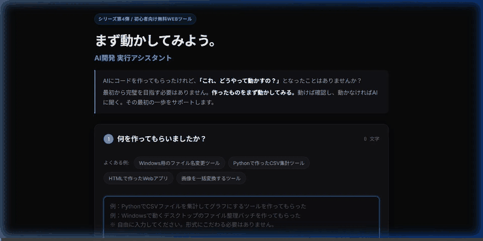

# まず動かしてみよう。

## AI開発 実行アシスタント

> AIが作ってくれた。
>
> じゃあ、まず動かしてみよう。

AIにコードを作ってもらった。

でも、

> 「これ、どうやって動かすの？」

となることがあります。

このツールは、AIが作ったソフトウェアを実際に動かしてみるまでの手順を整理し、AIへの実行確認用プロンプトを即時生成するための無料Webツールです（Zero-Dependency / Vanilla HTML・CSS・JS）。

- **WebツールURL**: https://tk030-lotto.github.io/mazu-ugokashitemiyou/  

---

## 💡 コンセプト

AI開発では、最初から完璧なソフトウェアを作る必要はありません。

まず、

> **作ったものを動かしてみる。**

動けば確認する。  
動かなければAIに聞く。  
それでいい。

---

## 🚀 使い方

### 1. AIが作ったものについて入力する
例えば、
- 「Windows用のファイル名変更ツールを作ってもらった」
- 「PythonでCSV集計ツールを作ってもらった」
- 「HTMLのWebアプリを作ってもらった」
- 「画像を一括変換するツールを作ってもらった」

など、プリセットチップを選ぶか自由に入力します。環境情報（Windows/Mac等）やファイル名の補足も任意で追加できます。

### 2. AIに実行方法を確認する質問を生成
入力内容をもとに、AIに以下を確認するための質問文をワンクリックで生成します：
- 必要な準備（必要なソフト・インストール手順）
- どのファイルをどこに配置するか
- 実行するための具体的な手順・コマンド
- 正常に動いたか確認するチェックポイント
- エラーが発生した場合の初動

### 3. ワンクリックでコピーしてAIへ送信
生成された質問文をコピーし、ChatGPT、Claude、GeminiなどのAIへ送信して実行手順を教えてもらいます。

### 4. 実際に動かして動作確認
AIから実行方法を教えてもらったら、手順に従って動かします。
- **動いた場合**: 「動きました！」として完了。次の改良へ進みます。
- **動かなかった場合**: エラーが出ても問題ありません。エラー解決用プロンプトをコピーしてAIに丸投げするか、シリーズ第5弾『エラーで止まらない。』へ進みます。

---

## 🛡️ このツールがしないこと（安全設計）

- このツール自身が利用者のPC上でコードやコマンドを実行することはありません。
- AIが作ったソフトウェアを自動的に修正することもしません。
- 目的は、**「AIが作ったものを、利用者が実際に動かしてみる」**ところまで進めることです。

---

## 📱 対応環境

- **ブラウザ**: 最新のモダンブラウザ（Chrome, Edge, Safari, Firefox）
- **デバイス**: スマートフォン（iOS, Android）およびPCブラウザに完全対応（レスポンシブ）
- **インストール**: 不要（GitHub Pagesで利用可能）
- **外部依存**: ゼロ（Zero-Dependency）

---

## 📚 「躊躇してないで、とにかく作ってみよう。」シリーズ

1. **① 何を作るか決めよう。** - 「作りたいものがない」
2. **② 何を作ってもらおう。** - 「アイデアを形にしたい」
3. **③ AIに聞いてみよう。** - 「分からないことがある」
4. **④ まず動かしてみよう。**（本作） - 「AIが作った。でも動かし方が分からない」
5. **⑤ エラーで止まらない。** - 「エラーをAIに丸投げする」

---

## 📄 ライセンス

MIT License

Copyright (c) 2026 tk030

Permission is hereby granted, free of charge, to any person obtaining a copy
of this software and associated documentation files (the "Software"), to deal
in the Software without restriction, including without limitation the rights
to use, copy, modify, merge, publish, distribute, sublicense, and/or sell
copies of the Software, and to permit persons to whom the Software is
furnished to do so, subject to the following conditions:

The above copyright notice and this permission notice shall be included in all
copies or substantial portions of the Software.

THE SOFTWARE IS PROVIDED "AS IS", WITHOUT WARRANTY OF ANY KIND, EXPRESS OR
IMPLIED, INCLUDING BUT NOT LIMITED TO THE WARRANTIES OF MERCHANTABILITY,
FITNESS FOR A PARTICULAR PURPOSE AND NONINFRINGEMENT. IN NO EVENT SHALL THE
AUTHORS OR COPYRIGHT HOLDERS BE LIABLE FOR ANY CLAIM, DAMAGES OR OTHER
LIABILITY, WHETHER IN AN ACTION OF CONTRACT, TORT OR OTHERWISE, ARISING FROM,
OUT OF OR IN CONNECTION WITH THE SOFTWARE OR THE USE OR OTHER DEALINGS IN THE
SOFTWARE.